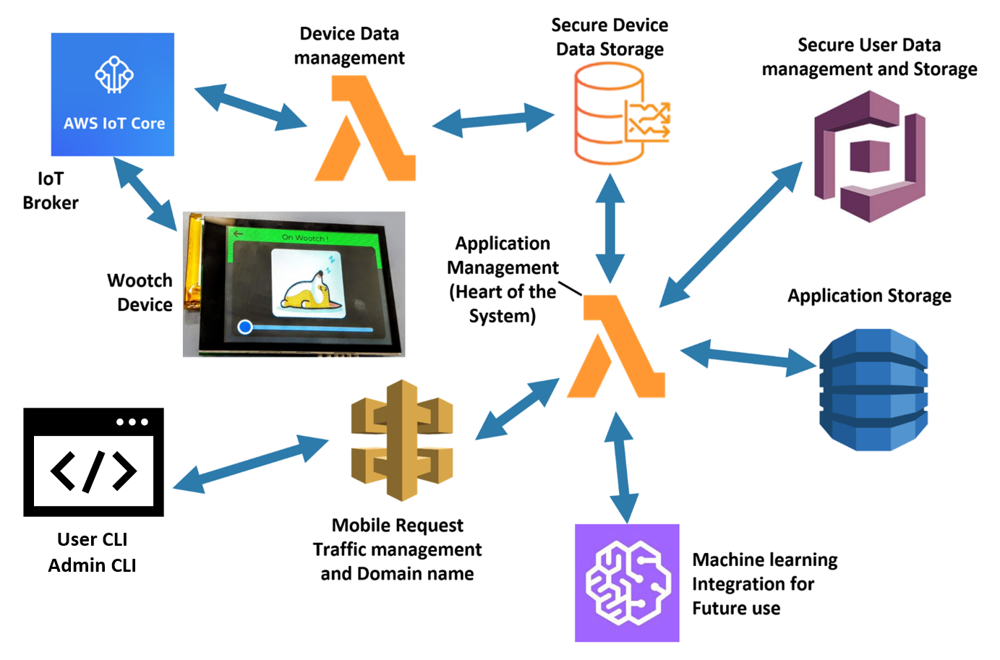

<h1 align="center">WOOTCH</h1>

# What's that ?

It wootches your door while your kids or/and cats sleep !

# Wait what ?

Wootch is an IoT device to monitor a door or any object activity and detect whether it is being moved. It then sends notifications to your registered device (phone or other) in case any activity is happening. Its intuitive Embedded UI helps you to set your level of guard ! (It can vibrate as soon as its door/object get touched, send you a message or let you live your life). It is connected to a cloud application to make sense of the sensors' data.

# What's the motives

Well ! Mainly, I like side projects and it was the occasion to experiment with technologies new to me.
 
Namely, Embedded UI (LVGL), Wifi enabled MCU (ESP32) and Serverless Application (AWS-CDK Framework).
 
Plus it's fun !

# PCB

Wootch's PCB has been made on Altium Designer. it features:

- Battery management, protection and regulators (buck)
- Inertial Measurement Unit (IMU, accelero + gyro)
- FPC connector for 3.5 inches LCD (480\*320px) touch capacitive
- Wifi enable MCU (esp32)
- Vibration motor and controller IC
- Speaker amplifier
- USB C charging
- Push buttons and RGB LED
- Programer/debugger

  (Sensie, was the project's former name)

 

&nbsp;&nbsp;&nbsp;&nbsp;&nbsp;&nbsp;

 

# Embedded System Firmware

(Work in progress : 70%)

The code is written in C (not C++) along the ESP-IDF SDK. (No arduino compatibility here).  
its main component are the following:

- ESP-IDF SDK, peripheral, wifi, RTOS.
- LvGL graphical library, to easily create responsive UI and provide support for the touch sensitive screen.
- esp_mpu60x0_C, MPU6050 IC from Invensense driver in C.
- ESP-AWS-IOT to interface with the AWS IoT-core service and provide a light-weight, fast and secured with AWS servers. It leverages the MQTT protocol with asymetric key exchange, symetric encryption.

 

&nbsp;&nbsp;&nbsp;=>&nbsp;&nbsp;&nbsp;

&nbsp;&nbsp;&nbsp;=>&nbsp;&nbsp;&nbsp;

 

# Serverless Application (Backend)

(Work in progress: 85%)

## AWS CDK Application

- Receive MQTT messages,
- Extract data and store them in a dynamoDB Database
- Run analytics on the stored data
- Manage Cognito users pool
- Send alerts/emails to users

## Admin Command Line Interface

- Create and manage Users
- Create and manage Devices and Certificates
- Automate the device registration process

## User Command Line Interface

- Log into the wootch account
- Pair with devices
- Manage the user's device(s)

 

 
(Simplified Architecture)

 
